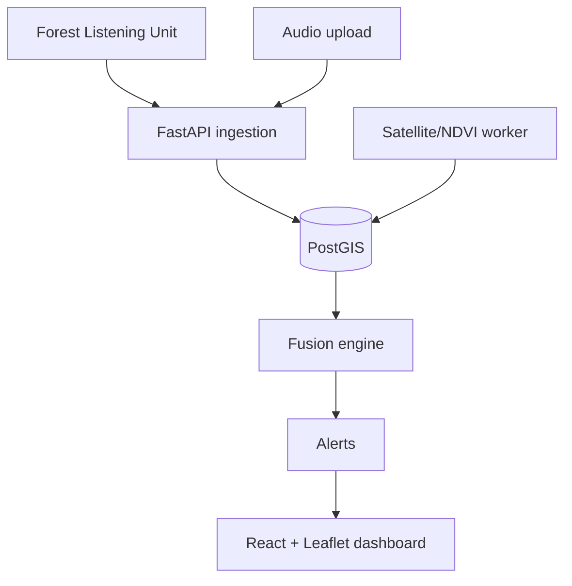

# Canopy Architecture

Canopy is organized as modular services that can run locally with Docker Compose and later be deployed independently.

## Components

- **Field devices:** Forest Listening Units capture audio and send metadata or short clips over LoRaWAN, cellular, or queued offline sync.
- **API service:** FastAPI exposes REST endpoints for authentication, sensors, alerts, and clip uploads, backed by repository functions that target PostgreSQL/PostGIS in Docker and SQLite in tests.
- **Database:** PostgreSQL with PostGIS stores users, organizations, regions, sensor points, alert points, and source metadata.
- **Audio pipeline:** Uploaded clips are validated, written to configured storage, recorded in the database, passed through `app.services.audio_classifier.classify_clip`, and converted into placeholder alerts until real model inference is added.
- **Satellite pipeline:** The schema reserves satellite image metadata and NDVI output references. Future workers will fetch imagery and calculate change alerts.
- **Fusion engine:** Future service that correlates acoustic events and vegetation changes by time and location.
- **Dashboard:** React + Leaflet UI displays operational metrics, sensor positions, and recent alerts.

## Local flow

## MVP lifecycle flow

The current working slice is: sign up or log in, create a geolocated sensor, upload an audio clip for that sensor, classify the clip with the deterministic placeholder service, create an audio alert at the sensor location, update alert lifecycle status, and export filtered alerts as CSV.

## Organization-scoped access

Organizations are the MVP tenant boundary. Signup creates an organization when `organization_name` is supplied and assigns the first user as `admin`. Regions, sensors, audio clips, and alerts carry `org_id`; repository functions validate that supplied region and sensor IDs belong to the authenticated user's organization before reads or mutations.
